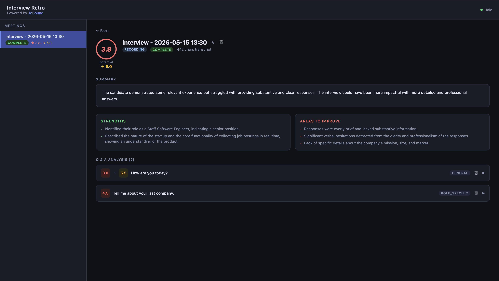
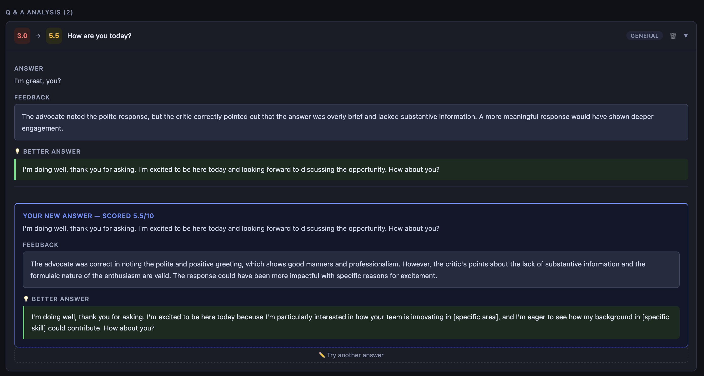

# 🎙 Interview Retro for meetily, by [JoBound](https://jobound.io)

Turn your meetily interview recordings into actionable coaching with CrewAI.
The app runs locally and uses Hugging Face for model inference.

| Component | Technology | RAM |
|-----------|-----------|-----|
| LLM (CrewAI) | Hugging Face Inference API | — |
| Storage | SQLite → iCloud Drive | — |

---

## Features

### Automatic meetily integration
Drop a recording in meetily and Interview Retro picks it up automatically. On every startup the app scans `~/Movies/meetily-recordings/` for `transcripts.json` files, skips anything it has already processed, and queues new interviews for analysis — no manual import required.

### 5-agent debate pipeline (CrewAI)
Rather than a single model rating your answers, each interview goes through a structured five-step pipeline designed to produce calibrated, honest feedback:

1. **Transcription agent** — cleans the raw transcript and adds speaker labels.
2. **Q&A extractor** — identifies every question–answer pair with timestamps.
3. **Advocate agent** — makes the strongest honest case *for* each answer.
4. **Critic agent** — reads the advocate's argument and constructs a concrete rebuttal.
5. **Judge agent** — weighs both sides and delivers the final verdict.

The adversarial advocate/critic step forces the model to engage with its own best arguments before scoring, producing significantly more calibrated results than a single-pass rating.

### Per-answer scores, feedback, and suggested answers
Every Q&A pair receives:
- A **0–10 score** based on the judge's ruling.
- **2–4 sentences of feedback** that explicitly reference what the advocate found strong and what the critic found lacking.
- A **suggested better answer** (written in your voice, not an essay) for any answer that scores below 6.

### Overall interview summary
Each interview also gets an aggregate **overall score**, a curated list of **strengths** and **weaknesses** that recur across all answers, and a one-paragraph **executive summary** of your performance.

### On-demand regrade
Changed your mind about a question? Hit regrade on any individual Q&A pair and the full advocate → critic → judge debate runs again for just that answer, without re-processing the whole interview.

### Web dashboard — opens automatically
The dashboard launches in your browser the moment the server starts. View all past interviews, drill into per-question breakdowns, and track your scores over time — no separate install needed.

### Queue-based async processing
Multiple interviews are handled in a background queue so the dashboard stays responsive while analyses run. A single worker processes one interview at a time for predictable throughput.

### iCloud Drive storage
The SQLite database lives in iCloud Drive and syncs automatically to every Apple device on your account. Browse or query it directly with [DB Browser for SQLite](https://sqlitebrowser.org) (free).

---

## Screenshots

The App


Test new responses


---

## Requirements
- uv
- [meetily](https://github.com/Zackriya-Solutions/meetily)
- Hugging Face API token (`HF_TOKEN`)

---

## Quick Start

```bash
# 1. Run setup
./setup.sh

# 2. Start it
uv run python backend/server.py
```

The dashboard opens in your browser automatically. Record an interview with meetily and the analysis will appear on its own.

Set your Hugging Face key in `.env` before starting:

```bash
HF_TOKEN=your_token_here
```

## Storage location

```
~/Library/Mobile Documents/com~apple~CloudDocs/JobBound/interview-retro/interviews.db
```

Auto-syncs to all Apple devices via iCloud Drive.

---

## Privacy

- ✅ Audio/transcripts are processed by your local app and sent to Hugging Face only for model inference
- ✅ Data stored in iCloud Drive (Apple-encrypted at rest)
- ✅ No telemetry, no accounts, no subscriptions
